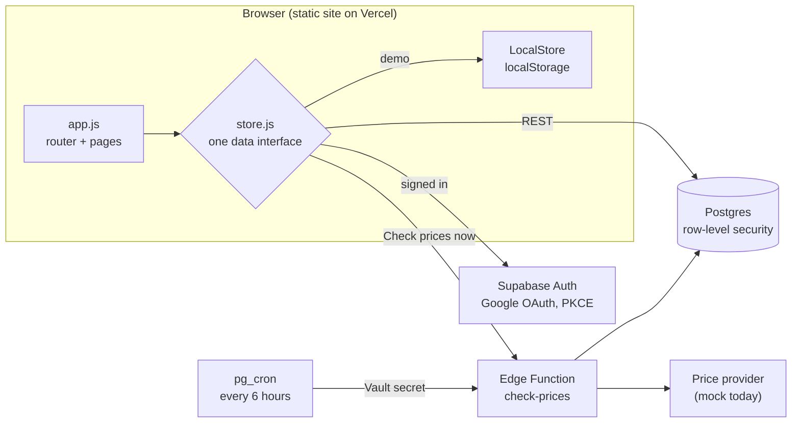

# GiftingSmart

Keep gift-giving on budget for any occasion: birthdays, holidays, baby showers, housewarmings.

- Create an event (e.g. "Lauren's birthday", "Christmas 2026", "Jane's baby shower")
- Set **one budget for the whole event**, or **a budget per person**
- Build a shopping list. Gift prices are tracked over time, and you get an alert when something goes on sale or reaches your target price
- Mark gifts as bought with the amount you actually spent
- A progress bar at the top of each event shows spent / still on the list / budget
- Warnings before a purchase takes you near (90%) or over budget, and when your whole list would go over

Plain HTML/CSS/JS, plus [Supabase](https://supabase.com) for Google sign-in, the database and the scheduled price checker, hosted on Vercel.

**Live:** [giftingsmart.shop](https://giftingsmart.shop). Use **Try the demo** to explore with sample data, no account needed.

## How it's built

### Architecture



| Layer | Technology |
|---|---|
| Front end | Plain HTML, CSS and JavaScript (ES modules). No framework or bundler; the only library is a self-hosted copy of supabase-js |
| Database and auth | Supabase: Postgres with row-level security, Google sign-in, Vault for secrets |
| Server code | Supabase Edge Functions (Deno, TypeScript) |
| Scheduling | `pg_cron` + `pg_net`, calling the price checker every 6 hours |
| Hosting | Vercel with a custom domain; a small Node build script generates the info pages, sitemap and config |

### Key decisions

- **One data interface, two implementations.** `SupabaseStore` and `LocalStore` expose the same async API, so the whole UI runs unchanged against the real database or against `localStorage`. That one choice gives local development with no setup and the no-account **Try the demo** mode on the live site.
- **Security lives in the database.** Every table has row-level security tied to `auth.uid()`; a trigger stops gifts and people being attached to someone else's event; table grants follow least privilege, and tables the browser shouldn't see have no policies at all. Rules were verified by impersonating the `anon` and `authenticated` roles inside rolled-back transactions (see `docs/privacy-audit.md`).
- **Shared pricing logic.** Sale detection and the simulated price model live in one plain ES module (`_shared/pricing.js`) that runs both in the Deno Edge Function and in the browser's demo mode. A drop counts as a sale only if it's at least 5% below the last price *and* the lowest in 30 days, which avoids alerting on noise.
- **Pluggable price providers.** The checker talks to a `PriceProvider` interface. The current `mock` provider produces deterministic, realistic price movement; a real API (Keepa, SerpApi, …) is one file plus a secret.
- **No hand-copied secrets for the cron job.** A migration generates a random secret in Supabase Vault; the scheduled job sends it, and a `security definer` database function verifies it. Nothing has to be pasted between dashboards.
- **Rate limiting in Postgres.** User-triggered price checks are limited to 20 per 10 minutes per account by a database function that takes a per-user advisory lock, so concurrent requests can't slip past the count.
- **Privacy by design.** No ads; Google Analytics only loads after a visitor accepts the cookie banner, and page views are anonymised (generic titles, no IDs). Fonts and the Supabase client are self-hosted, so visitors' browsers contact only this site and Supabase. The Google profile photo is never loaded (initials instead). Users can download all their data or delete their account, which cascades through every table.
- **Strict browser security.** A Content Security Policy allows scripts, fonts and images from this site only and network calls to Supabase only; all user text is escaped before rendering, and gift links must be `http(s)`. The Edge Functions reject browser requests from other websites.
- **Accessible and responsive.** Semantic HTML, focus moved to new content on each page change, live-region announcements for budget warnings, a keyboard-friendly hamburger menu below 1024px, light/dark themes (system default or manual, with no flash on load), and colour pairs checked against WCAG AA contrast.
- **Inclusive by default.** Occasion suggestions span many traditions (Hanukkah, Eid, Diwali, Lunar New Year, Vaisakhi, Nowruz and more), each labelled with the year it next occurs.

### Worth a look in the code

| File | Why |
|---|---|
| [`js/budget.js`](js/budget.js) | Pure budget maths: per-event and per-person budgets, and the "this purchase would put you over" warnings |
| [`js/store.js`](js/store.js) | The shared data interface and its two implementations |
| [`supabase/functions/_shared/pricing.js`](supabase/functions/_shared/pricing.js) | Deterministic price simulation and the sale-detection rule |
| [`supabase/functions/check-prices/index.ts`](supabase/functions/check-prices/index.ts) | Two auth paths (user token or cron secret), rate limit, provider calls, alerts |
| [`supabase/migrations/`](supabase/migrations/) | Schema, row-level security, cron schedule, rate limiting and the security hardening |
| [`scripts/build.mjs`](scripts/build.mjs) | Build step that generates pages and refuses to publish secret keys |
| [`docs/privacy-audit.md`](docs/privacy-audit.md) | Privacy audit and security review, with findings and fixes |

### What I'd add next

- Automated tests: unit tests for `budget.js` and `pricing.js`, and Playwright end-to-end tests for the main flows (create event, add gift, mark bought, over-budget warning).
- A real price provider, with per-store parsing and caching.
- Email alerts for sales, sent from the Edge Function.
- Shared events, so a family can plan one gift list together.

## Demo for visitors

The live site has a **Try the demo** button (home page, login page and menu). It runs the app on sample data kept only in the visitor's browser (no account, nothing sent to Supabase) and shows a banner with an **Exit demo** link. Prices throughout are simulated by the `mock` price provider, and the site says so in the footer, on event pages, the About page and the Terms.

## Run it locally

```bash
python -m http.server 5173
```

Open http://localhost:5173. With `config.js` left empty, the app runs in **demo mode**: "Continue with Google" signs you in as a demo user, data stays in your browser, and sample events are created. "Check prices now" moves a simulated clock forward six hours so you can watch prices move and sale alerts appear.

## Project layout

| Path | What it is |
| --- | --- |
| `index.html`, `styles.css`, `icon.svg` | Page shell, SEO tags and styles (light and dark) |
| `theme.js` | Applies the saved light/dark choice before the page draws |
| `config.js` | Supabase URL and anon key (both public); filled in at build time on Vercel |
| `pages/` | Content for the About, Privacy, Cookies, Terms and Legal pages |
| `scripts/build.mjs` | Vercel build: copies the site to `dist/`, generates the info pages and sitemap, writes `config.js`. **Set your name, contact email and province in `SITE` here.** |
| `scripts/render-images.sh` | Re-renders `og-image.png` and `apple-touch-icon.png` from the HTML sources beside it |
| `fonts/`, `vendor/` | Self-hosted fonts and supabase-js (with their licences), so visitors never contact third parties |
| `docs/privacy-audit.md` | Privacy audit and action items |
| `js/app.js` | Router and pages: home, log in, my account, my events, new event, event |
| `js/store.js` | Data layer: `SupabaseStore` (real) and `LocalStore` (demo) |
| `js/budget.js` | Budget maths and over-budget warnings |
| `supabase/migrations/` | Tables with row-level security, plus the 6-hourly cron job |
| `supabase/functions/check-prices/` | Edge Function that records prices and creates sale alerts |
| `supabase/functions/_shared/cors.ts` | Which websites may call the functions from a browser (`ALLOWED_ORIGINS` secret overrides the default) |
| `supabase/functions/delete-account/` | Edge Function that deletes the signed-in user's account and all their data |
| `supabase/functions/_shared/pricing.js` | Sale detection and the mock price provider (shared by server and browser) |

## Connect Supabase and Google sign-in

The live setup: Vercel project **gift-budget** is linked to Supabase project **GiftingSmart** through the Vercel Supabase integration.

1. **Supabase ↔ Vercel**: install the Supabase integration on the Vercel project. It adds `SUPABASE_URL`, `SUPABASE_PUBLISHABLE_KEY` and friends to the project's environment variables. On each deploy, `scripts/build.mjs` copies the site into `dist/` and writes those two public values into its `config.js` (never the secret or service role keys). Without them, the build keeps the demo-mode `config.js`.
2. **Google OAuth client**: in [Google Cloud Console](https://console.cloud.google.com/apis/credentials), create an OAuth client ID (type "Web application").
   - Authorized redirect URI: `https://<project-ref>.supabase.co/auth/v1/callback`
   - Configure the OAuth consent screen (app name, support email).
3. In Supabase, go to **Authentication → Sign In / Providers → Google**, enable it, and paste the client ID and secret.
4. In **Authentication → URL Configuration**, set the Site URL to the production URL (`https://giftingsmart.shop`) and add `http://localhost:5173` to the redirect URLs.
5. **Database**: apply the migrations (`supabase link --project-ref <project-ref>` then `supabase db push`, or paste them into the SQL editor). The schedule migration creates a random `cron_secret` in Vault. Then store the project URL in Vault so the cron job knows where to call:
   ```sql
   select vault.create_secret('https://<project-ref>.supabase.co', 'project_url');
   ```
6. **Price checker**: `supabase functions deploy check-prices --no-verify-jwt`. It checks its own auth: either a signed-in user's token, or the cron secret, which the database verifies. Optionally `supabase secrets set PRICE_PROVIDER=<name>` (default `mock`).
7. **Local development against Supabase** (optional): put the project URL and publishable key in `config.js`, but don't commit them. Without them the app runs in demo mode.

## Plugging in a real price API

Prices come from `PRICE_PROVIDER` (default `mock`, which simulates realistic prices and sales). To use a real source such as Keepa (Amazon), SerpApi (Google Shopping) or Rainforest:

1. Add `supabase/functions/check-prices/providers/<name>.ts` that implements `PriceProvider.getPrice(gift)`, using `gift.url` and/or `gift.name` and returning `{ price, source }` (or `null` if not found).
2. Register it in `providers/index.ts`.
3. `supabase secrets set PRICE_PROVIDER=<name> <NAME>_API_KEY=...` and redeploy the function.

Sale rules live in `_shared/pricing.js`: an alert fires when the price drops at least 5% from the last check **and** is the lowest in 30 days, or when it crosses your target price.

## Deploy

Import the repo in Vercel (framework "Other"; `vercel.json` sets the build command and output directory). Only the files listed in `scripts/build.mjs` are published; `vercel.json` also sets security headers. Add the production URL to Supabase's redirect URLs.

## Notes and next steps

- Alerts appear in the app (bell icon) and, if enabled under My account, as browser notifications while the app is open. Email or push alerts would be a natural next step (e.g. sending from the Edge Function).
- Prices are checked every 6 hours and may not match the store at checkout.
